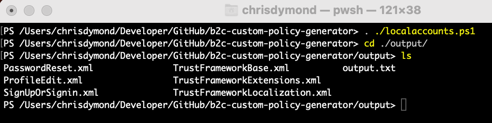
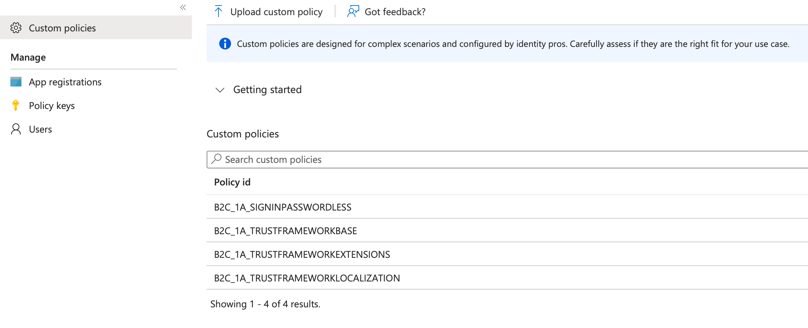

# Azure AD B2C Custom Policy Generator

Manually creating Azure AD B2C Custom Policies often involves a tedious and mistake-filled process. This project revolutionises that approach by introducing a set of streamlined scripts designed to automate the generation of policy files, significantly boosting efficiency and accuracy.

> 1. [Adding Signing and Encryption Keys for Identity Experience Framework](https://learn.microsoft.com/en-us/azure/active-directory-b2c/tutorial-create-user-flows?pivots=b2c-custom-policy#add-signing-and-encryption-keys-for-identity-experience-framework-applications)
> 2. Configure the config.json file according to your values from the steps in the link above.
> 3. Run the PowerShell script for your chosen output 'localaccounts-signin-passwordless-only.ps1', 'local-accounts-signin-only.ps1'...
> 4. From Output folder upload TrustFrameworkBase.xml, TrustFrameworkLocalization.xml, TrustFrameworkExtensions.xml ...

## Local Accounts
localaccounts.ps1
> Create Custom Policy XML for Local Account support only.

## Local Accounts with self-service signup disabled
localaccounts-signin-only.ps1
> Create Custom Policy XML for Local Account with Self-Service Signup disabled.

## Local Accounts with self-service signup disabled and passwordless
localaccounts-signin-and-passwordless-only.ps1
> Create Custom Policy XML for Local Account with Self-Service Signup disabled and Passwordless authentication only.

## Local Accounts and federated Azure AD
Pending.
