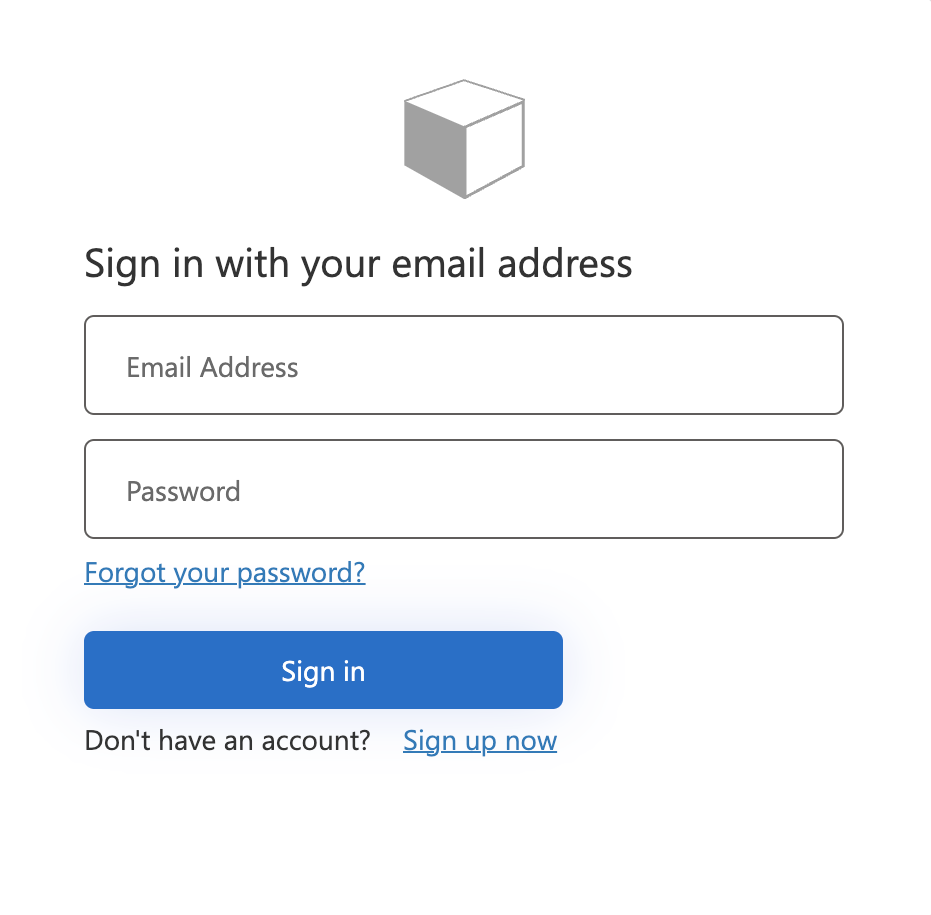

# Azure AD B2C Custom Policy Generator

Generation of Azure AD B2C Tenant Identity Experience Framework (IEF) XML policies.

> Configure the config.json according to your IEF values
[Adding Signing and Encryption Keys for Identity Experience Framework](https://learn.microsoft.com/en-us/azure/active-directory-b2c/tutorial-create-user-flows?pivots=b2c-custom-policy#add-signing-and-encryption-keys-for-identity-experience-framework-applications)

## Local Accounts
localaccounts.ps1
> Generate IEF XML for Local Accounts support only.

## Local Accounts with self-service signup disabled
localaccounts-signin.ps1
> Generate IEF XML for Local Accounts Only with self-service signup disabled.

## Local Accounts with self-service signup disabled and passwordless
localaccounts-signin-passwordless.ps1
> Generate IEF XML for Local Accounts Only with self-service signup disabled and passwordless authentication only.

## Local Accounts and federated Azure AD
Pending.